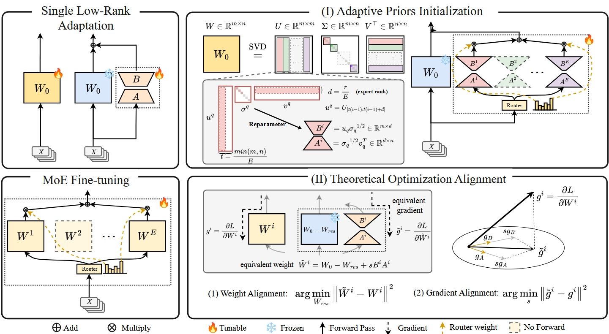

# GOAT: a new LoRA Mixture-of-Experts Framework🚀 

<div align="center">
<p align="center" style="font-size: larger;">
<strong> [ICML 2025] </strong> <a href="https://arxiv.org/pdf/2502.16894v3"> Make LoRA Great Again: Boosting LoRA with Adaptive Singular Values and Mixture-of-Experts Optimization Alignment</a>
</p>


</div>

Official implementation of **GOAT**: a novel framework that boosts Low-Rank Adaptation (LoRA) for large-scale model fine-tuning by integrating adaptive singular-value priors and theoretical optimization alignment within a Mixture-of-Experts (MoE) architecture.

Our Paper has been accepted by ICML2025.

## 🚀Highlights

- Adaptive Priors Initialization: Segment the pre-trained weight’s SVD into multiple chunks; initialize each MoE expert with a distinct singular-value segment, dynamically selected by the router.

- Theoretical Optimization Alignment: Derive closed-form scaling factors and residual corrections to align LoRA’s low-rank adaptation gradients and weights with full fine-tuning trajectories.

- State-of-the-Art Performance: Outperforms existing LoRA and LoRA-MoE baselines across 25 benchmarks in image classification, NLU, NLG, and commonsense reasoning, closing or exceeding full fine-tuning accuracy.


## Installation

Follow the steps below to set up the environment and install the necessary dependencies:

1. **Create a new Conda environment**:
   ```bash
   conda create --name goat python=3.9
   conda activate goat
   ```

2. **Install required dependencies**:
   Make sure you have `pip` installed, then run:
   ```bash
   pip install -r requirements.txt
   pip install flash-attn
   pip install human_eval
   ```


## Training

### Download Datasets

Most of the data is built into the `dataset/` directory. CV-related data needs to be downloaded separately, and the download method can be found in the corresponding training script.
- Since it is necessary to download data from Kaggle, the Kaggle key needs to be properly set in dataset/~data/download_dataset.sh.

### Training Scripts

- **Image Classification**:  
  Train on image classification datasets using Vision Transformers (ViTs):  
  ```bash
  bash vit.sh
  ```

- **Natural Language Generation (NLG)**:  
  Fine-tune for generation tasks, such as mathematical reasoning, code generation, or chatbot tasks:  
  ```bash
  bash math.sh   # For math reasoning tasks
  bash code.sh   # For code generation tasks
  bash chat.sh   # For chatbot tasks
  ```

- **Natural Language Understanding (NLU)**:  
  Fine-tune on NLU tasks, such as the GLUE benchmark:  
  ```bash
  bash glue.sh
  ```

---

## Evaluation

In Training, our training script will automatically evaluate the downstream tasks (Performance log on Wandb), except for chat task.

For chat task, we use [FastChat](https://github.com/lm-sys/FastChat) to generation and evaluate with GPT-4, please read their instruction.

---

## Citation

If you find our work helpful, please consider citing our paper:
```bash
@misc{fan2025makeloragreatagain,
      title={Make LoRA Great Again: Boosting LoRA with Adaptive Singular Values and Mixture-of-Experts Optimization Alignment}, 
      author={Chenghao Fan and Zhenyi Lu and Sichen Liu and Xiaoye Qu and Wei Wei and Chengfeng Gu and Yu Cheng},
      year={2025},
      eprint={2502.16894},
      archivePrefix={arXiv},
      primaryClass={cs.CL},
      url={https://arxiv.org/abs/2502.16894}, 
}
```

## Contact
If you have any question, feel free to contact 📫 facicofan@gmail.com or luzhenyi529@gmail.com

## References
The code refers to the repo [LoRAPro](https://github.com/mrflogs/LoRA-Pro)
